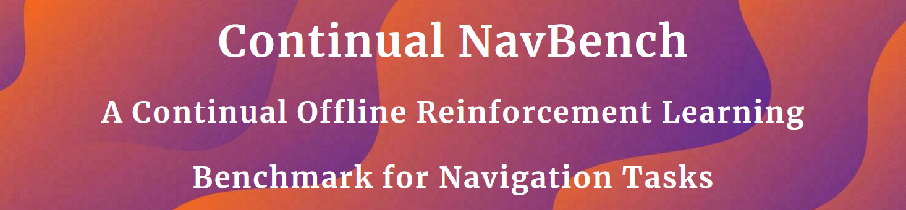
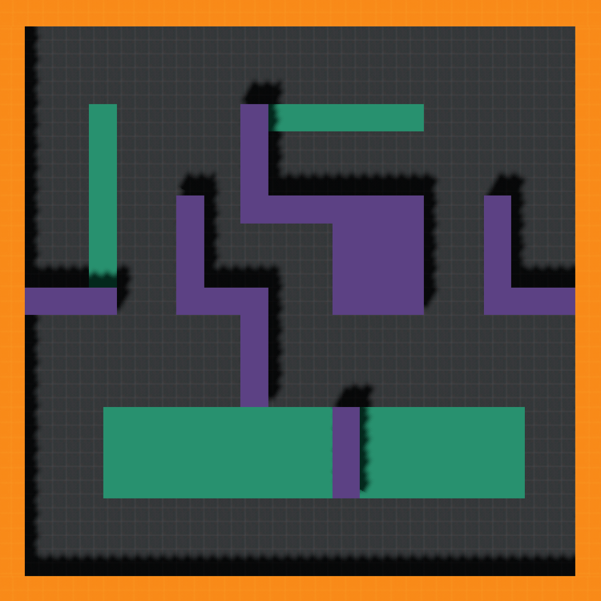
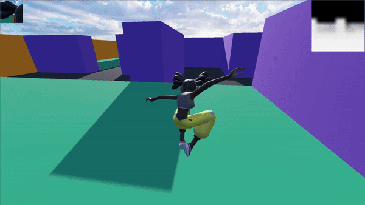
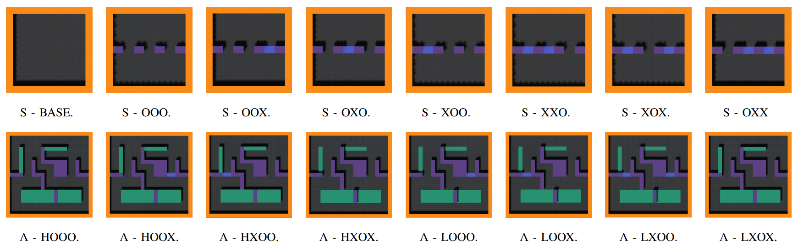

    

        <h2>
            <a href="./articles/paper.pdf">Paper</a>
            &emsp;
            &emsp;
            &emsp;
            <a href="https://sites.google.com/view/continual-nav-bench/home?authuser=2">Project Page</a>
            &emsp;
            &emsp;
            &emsp;
            <a href="https://drive.google.com/drive/folders/1QHzGofKymDIkoN1_4FlPwLlJ0pFwilUo?usp=sharing">Datasets</a>
        </h2>
  

## Overview

Continual NavBench is an open-source benchmark for evaluating Offline Continual Reinforcement Learning (CRL) in video game–inspired navigation tasks. It provides Godot-based 3D maze environments, human-generated datasets, task streams, and standardized evaluation protocols to foster reproducible research and guide production-grade AI integration.

***Abstract***

*In dynamic domains such as autonomous robotics and video game simulations, agents must continuously adapt to new tasks while retaining previously acquired skills. This ongoing process, known as Continual Reinforcement Learning, presents significant challenges, including the risk of forgetting previously acquired knowledge and the need for scalable solutions. Building on recent advances in hierarchical policy representations, our benchmark provides a suite of navigation scenarios capturing key challenges: such as catastrophic forgetting, task adaptation, and memory efficiency. We define a set of various tasks and datasets, evaluation protocols, and metrics to assess the performance of algorithms, including state-of-the-art baselines. Our benchmark is designed not only to foster reproducible research and accelerate progress in continual reinforcement learning for gaming, but also to provide a robust evaluation framework to rigorously test navigation methods — helping practitioners identify the most effective approaches to drive advances in production pipelines.*

***Visualization of Human Playing***

  
  

## **1. Getting Started**

### *1.1. Installation*

Follow the installation instructions in the [Windows (11)](./installation/WINDOWS.md), [WSL2 (Ubuntu 22.04)](./installation/WSL.md), or [Linux (Ubuntu 22.04)](./installation/LINUX.md).

Once it is done, download the [executables](https://drive.google.com/drive/folders/1ixd0XJI--7MsZ-gOxF00POYzYYLmJ-6V?usp=sharing) and place them in the folder `./python/offbench/envs/godot_goal/executables/`.

### *1.2. Pre-Collected Datasets*

Download the datasets of episodes from [this link](https://drive.google.com/drive/folders/1QHzGofKymDIkoN1_4FlPwLlJ0pFwilUo?usp=sharing).  
Place the folder `datasets/godot/` inside the repository folder `continual-nav-bench/datasets/` directory so that the final path is `continual-nav-bench/datasets/godot/`.

### *1.3. Collect Trajectories*

Please refer this [tutorial](./datasets/README.md) to play and generate data by yourself.

### *1.4. Launch a Training and Monitor Results*

Please refer to this [tutorial](./experiments/README.md) to launch trainings and monitor the results*.

Trained models are available [here](https://drive.google.com/drive/folders/1QHzGofKymDIkoN1_4FlPwLlJ0pFwilUo?usp=sharing).

## **2. Algorithms**

For single-task learning, we include the following baselines :

- [GCBC : Goal-Condiioned Behavioral Cloning](./articles/singletask/GCBC.pdf) ;
- [HGCBC : Hierarchical Goal-Condiioned Behavioral Cloning](./articles/singletask/HGCBC.pdf).

For continual learning, we provide common methods and others from the literature :

- [EWC : Overcoming Catastrophic Forgetting](./articles/continual/EWC.pdf) ;
- FRZ : Training only on the first task, and freezing model for next tasks ;
- FT1 & FTN : Finetuning with (N) and without (1) keeping previous models ;
- [HISPO : Hierarchical Subspace of Policies for Continual Offline Reinforcement Learning](./articles/continual/HISPO.pdf) ;
- [L2 : Maintaining Plasticity in Continual Learning via Regenerative Regularization](./articles/continual/L2.pdf) ;
- [PNN : Progressive Neural Networks](./articles/continual/PNN.pdf) ;
- RPL : Replay-based training with all previous datasets accumulated ;
- SC1 & SCN : Training from scratch with (N) and without (1) keeping previous models.

Benchmark results are available in the [benchmarks folder](./benchmarks/CONTINUAL.md).

## **3. Environments & Datasets**

Continual NavBench focuses on video game–inspired navigation:

- **SimpleTown :** 8 simple mazes ( $20\times20\ m$) with randomized start/goal positions.
- **AmazeVille :** 8 complex mazes ( $60\times60\ m$) with fixed start/goal positions and varied obstacle configurations.

Datasets in both families are human-generated from roughly $10$ hours of gameplay, providing human-like navigation trajectories. Analysis of these datasets are available in `experiments/0_data_analysis/`.

***SimpleTown \& AmazeVille Trajectories***

The naming convention of the tasks use a prefix for the maze family (S for *SimpleTown*, and A for *AmazeVille*), the the subsequent characters encode key layout features where “O” and “X” are respectively open and closed doors, and “H” and “L” denote high and low blocks.

When it comes to naming the datasets, given the order provided in the above figure, the *SimpleTown* datasets are named `simpletown-maze_i` with `i` between `0` and `7`. For *AmazeVille*, the naming convention of the datasets are `amazeville-maze_i-mode` with `i` between `1` and `4`, and `mode` in `{ low , high }`.

## **4. Task Streams**

Our benchmark defines task streams with different maze configurations. We distinguish two types of streams :

- **Random Streams :** In AmazeVille we have :
  - *Stream 1 :* A-LOOX → A-HXOX → A-LXOX → A-HXOX ;
  - *Stream 2 :* A-HXOO → A-HOOX → A-LOOX → A-LXOO.

- **Topological Streams:** Designed with systematic common
changes in maze structure. We have in both environments :
  - *Stream 1 :* A-HOOX → A-HXOX → A-HXOX → A-HOOX ;
  - *Stream 2 :* A-LOOO → A-LOOO → A-LXOX → A-LXOO ;
  - *Stream 3 :* S-BASE → S-OXO → S-BASE → S-OOX ;
  - *Stream 4 :* S-BASE → S-OXX → S-XOO → S-OXX.

Notably, some tasks reoccur within a stream, offering an opportunity to evaluate whether an algorithm can recognize and reuse previously learned strategies without increasing model size or compromising performance. We encourage future users to tailor task streams to address specific research or production goals. Additionally, these environments are well-suited for developing and benchmarking GCRL algorithms

## **5. Additional Resources**

For more detailed information on our experiments, analysis, and implementation details, please refer to the `experiments` folder and our [project website](https://sites.google.com/view/continual-nav-bench/).

---
---
